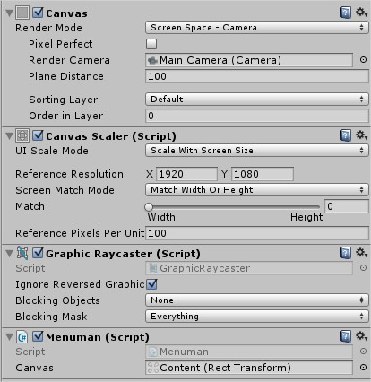

# Unity Parallax Menu UI

- Check your canvas setting, the render mode should be Screen Space Camera
- After that, add empty game object like Content. Content is like a group of everything that will be moved by script
- Add this script on Canvas and set Canvas variable as your Content Rect transform
- also you need to adjust minMaxAxis, it’s an array, 0 usually -15, and 1 usually 15
